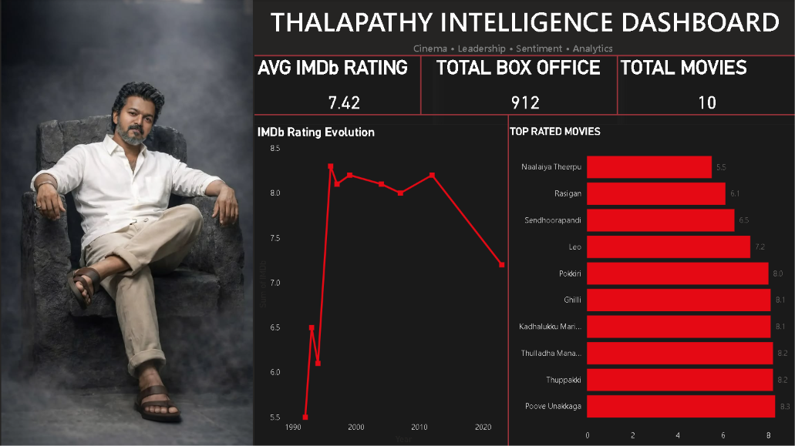
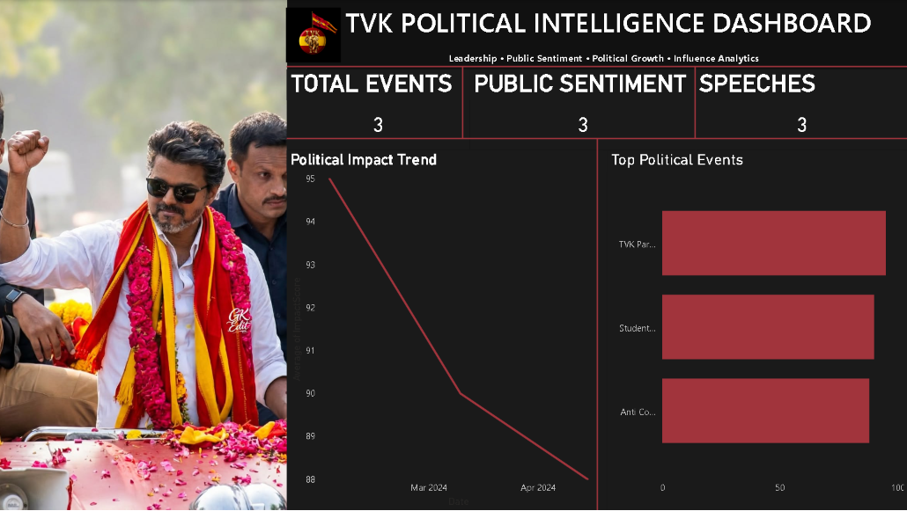
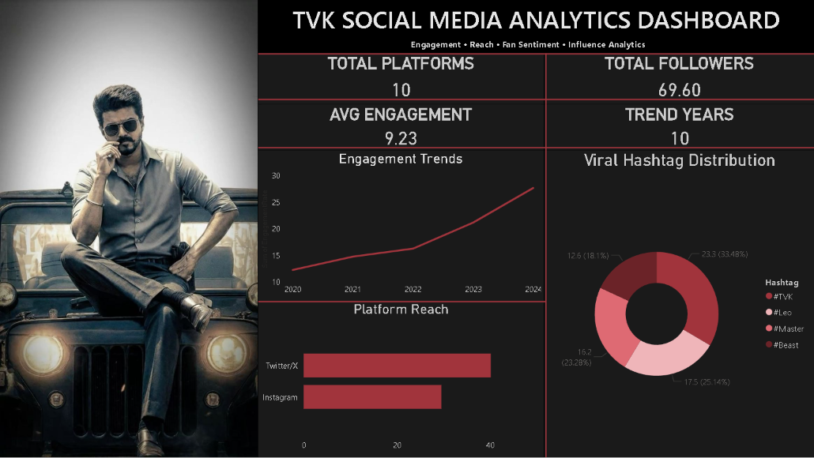
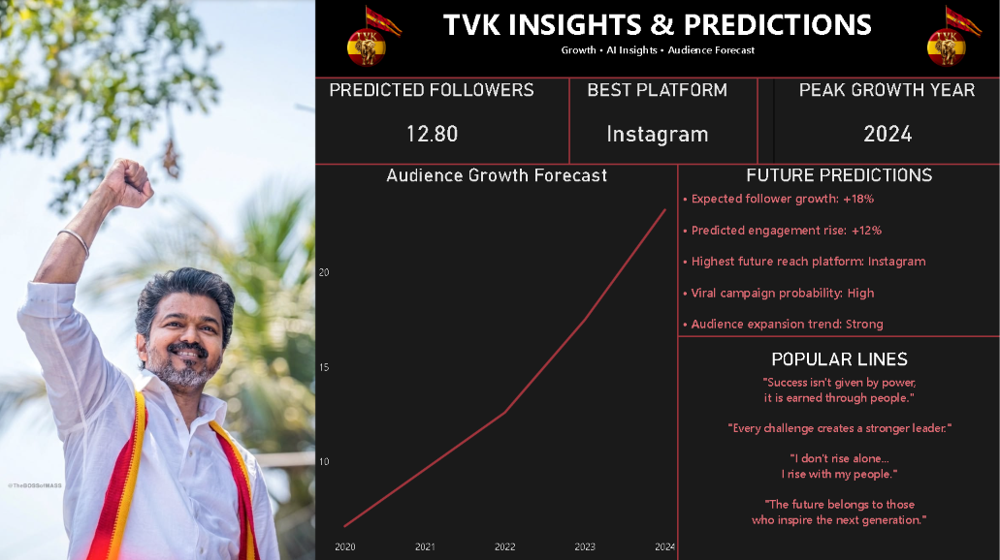
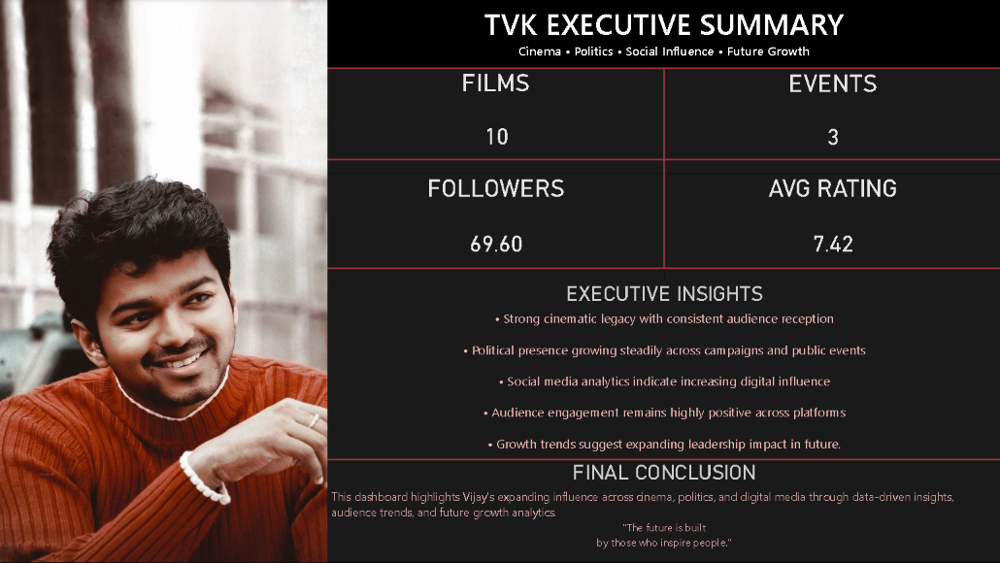

**# TVK Intelligence Dashboard

A cinematic multi-page Power BI dashboard analyzing Vijay's influence across:

- Cinema
- Politics
- Social Media
- Audience Engagement
- Future Growth Trends

## Dashboard Pages

### 1. Overview
Film analytics, IMDb trends, and box office insights.

### 2. Political Intelligence
Political events, sentiment analysis, and influence tracking.

### 3. Social Media Analytics
Platform reach, engagement trends, hashtag analytics, and audience growth.

### 4. Insights & Predictions
Future audience growth forecasting and engagement predictions.

### 5. Executive Summary
Final executive-level overview combining all insights.

## Tools Used

- Power BI
- Data Visualization
- KPI Analytics
- Forecasting
- Social Media Analysis

## Dashboard Preview

### Overview

### Political Intelligence

### Social Media Analytics

### Insights & Predictions

### Executive Summary

## Author

Vaibhav Pandey
